# WarriorRun

**WarriorRun** is a free and open-source endless-runner game built with Unity 6 (URP).
Sprint through snowy peaks, volcanic chasms, neon nights, forests, canyons, city
streets, temples, vaults and lagoons — dodge, jump, slide and **take corners**
Temple Run–style as the track bends through walled junctions, past procedurally
built stylized props in a chunky, saturated low-poly art style that flies on
ordinary phones.

> This project is open source. Read it, fork it, learn from it, ship your own runner.

## Gameplay Demo

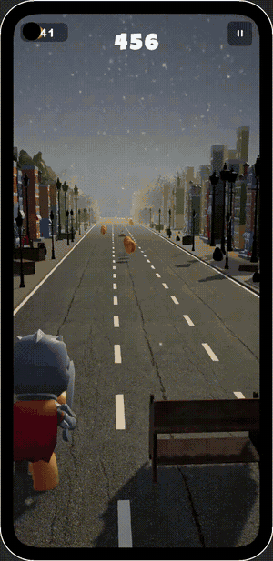

<p>
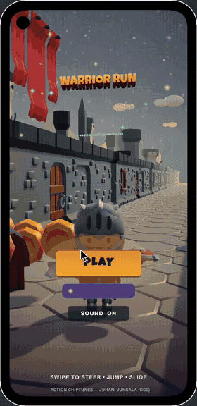
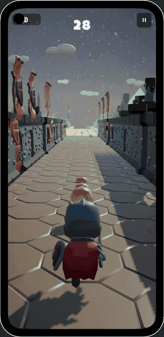
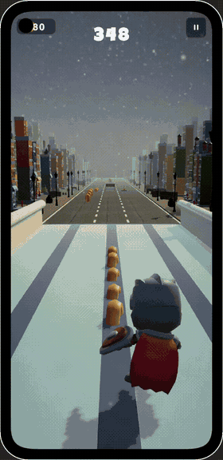
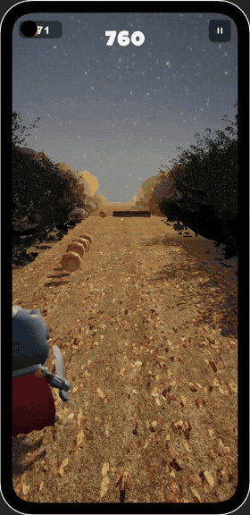
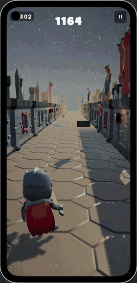
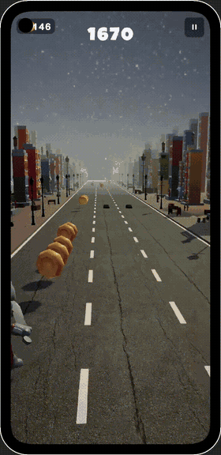
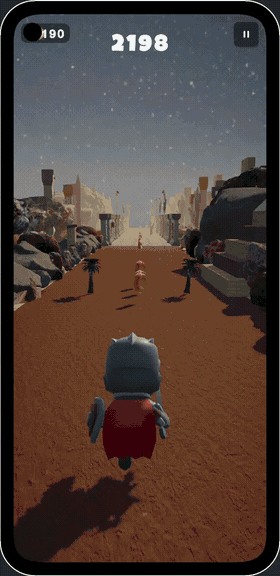
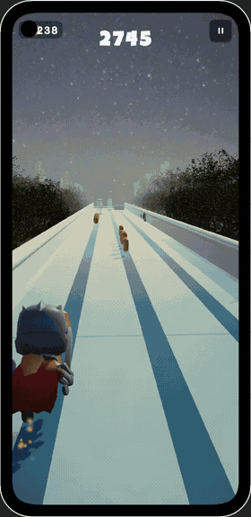
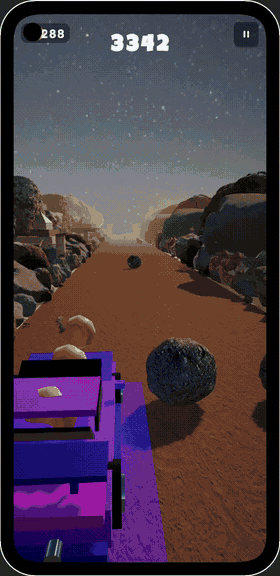
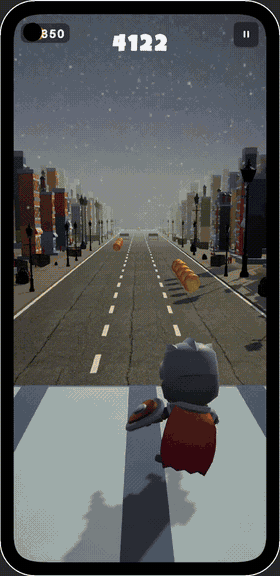
</p>

▶ Full video: [docs/media/gameplay.mp4](docs/media/gameplay.mp4)

*(Recorded before the stylized restyle — the current build looks chunkier and
far more colourful.)*

## Download & Play

- **Android:** grab the APK from
  [Releases](../../releases/latest) → `WarriorRun.apk` (~42 MB).
  Sideload it: copy to the device, tap, allow "install unknown apps" when asked.
- **iOS:** no downloadable build — iOS apps can't be sideloaded without Apple
  signing. To run it on an iPhone/iPad, build from source: install Unity's
  **iOS Build Support** module, switch platform to iOS, and build an Xcode
  project, then archive/sign it with your Apple ID in Xcode.

## Gameplay

- Classic 3-lane endless runner: swipe to switch lanes, jump, and slide
- **Temple Run–style corner junctions** — the track bends 90° through walled
  plazas every few tiles; gold HUD chevrons flash as a corner approaches and
  you must swipe the right direction before the bend. Miss it and you meet the
  dead-end wall — or the void. Occasional S-bends chain two corners back to
  back. The whole world bends with the path: camera swing, coins, decor, fog,
  and distance scoring all follow the spine.
- **Ten biome zones** in a shuffled rotation — Temple, Forest, Vault, Canyon,
  City, Lagoon, plus **Volcano** (a single pinned lane on a narrow basalt
  bridge over breathing lava — no lane to dodge into, every blocker is a
  jump or a slide), **Frost** (snowy peaks, snowmen, ice crystals), **Ember**
  (basalt and glowing lava veins, obsidian crags) and **Neon** (night strip,
  glowing lane guides, holo cubes)
- Each zone has its own tile skins, decor set, obstacle pool and fog colour —
  and stays put for a good stretch (~336 m) so biomes actually register
- Smart obstacle placement: at least one lane is always clear, the same lane
  never walls twice in a row, and a shared wildcard pool mixes surprises into
  every zone
- Coins, power-ups, score chasing — runs until you crash
- Random background music: a pool of hip-hop beat loops (plus title track) —
  a different track every run, never the same one twice in a row
- Menu diorama with animated scenery, parallax, and ambient audio
- Animated loading screen between scenes — the game world streams in
  asynchronously behind a spinner + progress bar, so transitions never hitch

## Tech Stack

- **Engine:** Unity `6000.6.3f1`
- **Render pipeline:** Universal Render Pipeline (URP 17.6.0)
- **Backend:** IL2CPP, Android (arm64-v8a)
- **Assets pipeline:** glTFast 6.20.0 runtime imports of `.gltf` models
- **Input:** Unity Input System (touch swipe gestures + keyboard in editor)
- **Audio:** Unity Audio + TextMeshPro UI; beat loops are synthesized WAVs
  generated by the editor pipeline (`beat_*.wav` under `Resources/Audio` are
  auto-discovered and randomized)

## Art Direction

Everything is chunky, saturated, low-poly — colourful enough that the low
triangle count reads as style, not budget:

- **Procedural glTF models** — all ~50 world models (trees, rocks, barriers,
  benches, statues, props) are generated in Blender by
  `blender_lowpoly_assets.py`: stylized silhouettes, slight bevels, flat vertex
  colours, ~300–1500 tris each (~5,700 tris across the whole set)
- **Procedural prefabs** — the editor pipeline (`ExtraContent.cs`) composes
  primitives into themed obstacles and decor: snowball piles, lava pools,
  obsidian spikes, neon beams, pylons, holo cubes… no external art needed
- **Blender turn assets** — `blender_turn_assets.py` generates the corner
  junction props (stone exit gate, trail signpost) that mark every bend
- **Flat-colour URP materials** — 60+ saturated Lit materials, no texture maps
- **Procedural sky** — Unity's built-in procedural skybox + trilight ambient;
  per-zone fog colour lerps as biomes change

### Performance notes

The realistic/photogrammetry pipeline was fully replaced for mobile:

- Scan meshes regenerated to low-poly equivalents — ~818K → ~5.7K tris total
- 630 MB of textures/HDRI/unused packs deleted — `Art/` is ~18 MB now
- APK size: **~41 MB** (down from ~168 MB)
- No SSAO, no HDR — GLES3, render scale 0.7
- Decor footprints are programmatically clamped so nothing spills onto the lanes

## Project Layout

```
Assets/WarriorRun/
  Scripts/        runtime gameplay — TrackManager recycling, player, input, audio
  Editor/         WarriorRunBuilder (procedural pipeline), StylizedUpgrade
                  (flat-colour restyle + prefab validation + build),
                  ExtraContent (new biomes / obstacles / synth beats)
  Prefabs/        tiles, obstacles, decor, player
  Scenes/         Menu.unity + Game.unity
  Resources/Audio beat_*.wav/beat_*.mp3 loops — picked at random each run
  Art/Realistic/  Blender-generated stylized glTF models
blender_lowpoly_assets.py  regenerates every model (headless Blender)
blender_turn_assets.py     generates the corner-junction props (gate, signpost)
blender_make_assets.py     original obstacle generator
blender_decimate.py        decimates scan meshes to mobile budgets
```

## Building

1. Install Unity Hub + Unity `6000.6.3f1` with the **Android Build Support** module
   (SDK/NDK + OpenJDK).
2. Clone the repo and open it in Unity.
3. Menu ▸ **WarriorRun → Rebuild All** regenerates procedural content
   (scenes, materials, prefabs) if needed.
4. **Build ▸ Build** targeting Android produces `Builds/Android/WarriorRun.apk`.

Headless/CI build (full pipeline: prefab/scene regen → stylized restyle →
extra content → validation → APK):

```bash
Unity -batchmode -nographics -projectPath <repo> \
  -executeMethod WarriorRun.EditorTools.StylizedUpgrade.FullRebuildAndroid -quit
```

The same pipeline is available in-editor via menu ▸ **WarriorRun →
Full Rebuild + Android APK**.

## Asset Credits & Licenses

- **Code:** MIT — see [LICENSE](LICENSE).
- **Models:** all generated in-house via the Blender/procedural scripts in this
  repo — no third-party art shipped.
- **Music:** synthesized beat loops generated by the editor pipeline; bundled
  menu/run tracks include "Action Chiptunes" (Juhani Junkala / SubspaceAudio,
  **CC0 1.0**). https://opengameart.org/content/5-chiptunes-action
- Fonts and remaining template art ship with their original licenses.

## Contributing

Issues and PRs welcome — new zones, obstacles, runner mechanics, perf work,
audio. Keep the visual bar stylized: chunky silhouettes, saturated colours,
nothing photorealistic.
